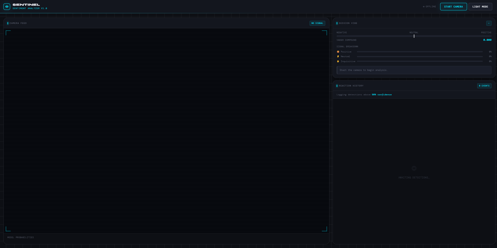
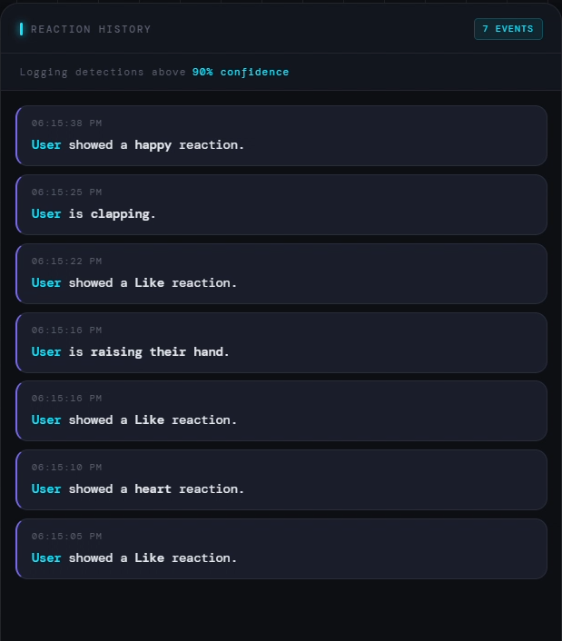

# Sentinel — Sentiment Analyzer

A small client-side web application that performs **real-time sentiment/emotion detection** using a Teachable Machine image model. Built with HTML, CSS, and JavaScript, the app captures webcam video, classifies user reactions, and displays probabilities, emoji effects, and a log of detections.

---

## Features

- Live camera feed with model inference
- Animated emoji overlays for recognized reactions
- Probability badges for each class
- Reaction history logger with timestamps
- Light/dark theme toggle
- Supports custom Teachable Machine models

---

## Tools used

- **Teachable Machines by Google** for capturing users' camera feed and processing it.
- **Vader Sentiment Analysis** for the overall session analysis.
- **HTML** for the main interface of the system.
- **JavsScript** for the main logic backbone
- **CSS** for front-end designing.

---

## 🗂 Project Structure

```
index.html               # main page
script.js                # application logic
style.css                # custom styles and themes

jc_latest_tm_model/      # default Teachable Machine model used by the app
    metadata.json
    model.json

jc_tm-my-image-model/    # additional example model folder
    metadata.json
    model.json

tim_tm-my-image-model/   # another example model folder
    metadata.json
    model.json
```

All model folders are in the project root and contain the files exported from Google Teachable Machine (image project). To point the app at a different model, update the `URL` constant in `script.js` or modify the UI accordingly.

---

## Getting Started

### Requirements

- Modern browser with webcam support (Chrome, Edge, Firefox)
- A simple HTTP server to serve the files (camera access is blocked on `file://`)

### Running Locally

1. **Clone or download** the repository to your machine.
2. Open a terminal in the project folder.
3. Start a static file server. For example:
   ```powershell
   # using Python 3
   python -m http.server 8000

   # or using Node.js
   npx serve .
   ```
4. Visit `http://localhost:8000` (or the port you chose) in your browser.
5. Click **Start Camera** and grant permission when prompted.

> The app won't work when opened directly from the filesystem (`file://`).

### Using the App

- **Start/Stop Camera**: Click the button in the header to toggle the webcam.
- **Model Probabilities**: See live percentages for each predicted class.
- **Emoji Effects**: Recognized reactions display floating emoji glyphs.
- **Reaction Log**: History panel on the right records events above 90% confidence.
- **Theme Toggle**: Switch between light and dark modes using the button.

---

## Customizing the Model

- Train or export a new image model from [Teachable Machine](https://teachablemachine.withgoogle.com/).
- Copy the downloaded folder into the project root.
- Update the `URL` constant in `script.js` to point to the new folder name, e.g.:
  ```js
  const URL = "./my_new_model/";
  ```
- Reload the page and start the camera.

---

## Additional Notes

- The app includes two other model folders (`jc_tm-my-image-model` and `tim_tm-my-image-model`) for testing or as templates.
- All styling is defined in `style.css`. Feel free to adjust tokens, themes, or layout.
- The JavaScript code (`script.js`) is kept lightweight and relies on `@tensorflow/tfjs` and the Teachable Machine helper library.

---

## Acknowledgements

Built as part of a practical exam project. 

## System Images






## License

This is an educational/demo project; use and modify freely.
